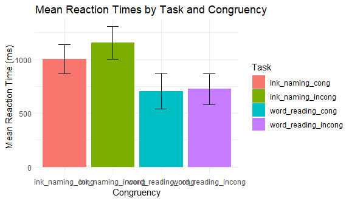
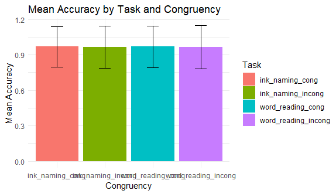

# Stroop Effect Analysis  
This project analyzes the Stroop effect, a psychological phenomenon where there is a delay in reaction time when the meaning of a word conflicts with its color.  
The analysis includes data preprocessing, descriptive statistics, and regression modeling to examine response times under congruent and incongruent conditions.  

## Response Time Results  

## Accuracy Results  

